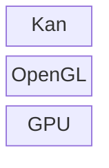

# Kan: A C++ 3D graphics library


[](https://github.com/brobeson/kan/actions/workflows/build.yaml)

Kan is a 3D graphics library, an abstraction layer above OpenGL.



## Quick Start

1. Install dependencies.
   ```bash
   sudo apt install libglew-dev libglu1-mesa-dev mesa-common-dev
   ```
1. Configure the build system.
   ```bash
   cmake -B build/ -S .
   ```
1. Build the software.
   ```bash
   cmake --build build/
   ```
1. Run a demo application.
   ```bash
   ./build/demos/triangles
   ```

Read more in the complete [build documentation](docs/build.md).
